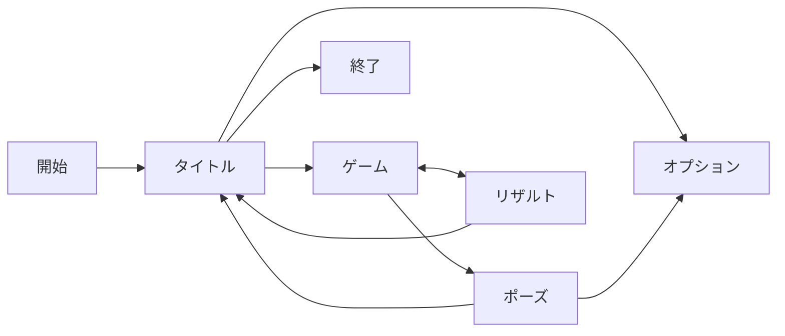

# リンク置き場
https://note.com/rodz/n/n11a2420edcc0

# 仕様
## ゲームフロー
ゲームを開始 > タイトルからゲームスタート > プレイ > ゲームオーバー > リザルト表示 > タイトルもしくはリトライ
タイトル画面からオプション、もしくは終了
ゲーム中はポーズができ、オプションもしくはタイトルに遷移できる

## 画面遷移
オーバーレイ画面からは元の画面へ戻れる
基本画面に行くとレイヤ構造がリセットされる
- タイトル
- オプション（オーバーレイ）
- ゲーム
- ポーズ（オーバーレイ）
- リザルト

## 基本ルール
- ゲームフィールド
20x10マス
出現前のバッファとして4マス

- 基本サイクル
ゲームを始めるとカウントダウンが始まってスタート

上から徐々に落ちてくる テトリミノ を操作してフィールドに配置する
	横一列がすべて埋まると ライン消去
	消去するとその分、スコアが加算される

NEXTミノを1つ見ることができる
ミノを1つホールドできる

- レベル
[[#レベル仕様]]
時間経過もしくはライン消去ででレベルが上がっていく
レベルが上がると難しくなっていく

- ゲームオーバー
ブロックがフィールド上部まで積み上がると ゲームオーバー
	出現時もしくはロックされた時にフィールドのアクティブな部分からはみ出る

- リザルト
ゲームオーバー時点のスコアがリザルトとして表示される

## テトリミノ仕様
- 種類
全7種類（I, O, T, S, Z, J, L）
各ミノは4ブロック構成

- 出現
テトリミノの出現は7種を1セットとした7バッグ方式
7種を1セットとして、そのセットが全て出るまでバッグからランダムに出現する

- 落下速度
ミノは一定速度で落下する
レベルが上がると落下速度が徐々に早くなる
	速度は実際の挙動で調整

- 操作
[[#操作仕様]]
テトリミノはO以外90度単位で回転可能
	壁際での回転は補正をかける（SRSの実装にチャレンジする）
		https://shiwehi.com/tetris/template/srs.php
	隙間にねじ込むことも可能
		Tスピン・SZスピン・Iスピン・JLスピン

高速に落とすソフトドロップ、一瞬で落とすハードドロップ操作ができる

- ロック
接地すると一定時間で位置・回転がロックされる

一定時間の間に移動もしくは回転するとロック時間がリセットされる
	ロック時間は0.5秒を基本として調整

レベルが上がると徐々に時間猶予が短くなる

- ホールド
ミノを1つホールドしておくことができる

初回ホールドはミノがホールドに入って次のミノが落ち始める
既にホールドにミノがある場合は、ミノが入れ替わる
	入れ替わったミノは上から落ちてくる
1度ホールドから取り出したものを再度戻すことはできない（無限再ホールド防止）

## ライン消去時仕様
- 消去の判定
ラインが横一列で揃うと消える
同時に4ラインまで消去可能（テトリミノの種類上の制限）
消えた跡、上のブロックが落下する（アニメーションあり）
	落下するのはライン分だけで、隙間は埋まらない

- 消去演出
点滅して消えるアニメーション
落下するアニメーション

## スコア仕様
消去したラインのスコア×レベル倍率で決まる

| ライン数 | スコア |
| ---- | --- |
| 1    | 100 |
| 2    | 300 |
| 3    | 500 |
| 4    | 800 |
同じ数の列を消したときに、一度に多くのラインを消したとき（高難易度）の方がよりスコアが出る

Tスピンは、いったんスコアに考慮しない

### ハイスコア
累計のハイスコアが端末に保存される

## レベル仕様
ラインを一定数消去するとレベルが上がる
レベル×10ラインを基本として

レベルが上がると画面全体に演出が出る

- レベルが上がると変化するもの
	- ミノの落下速度が早くなる
	- ロックまでの時間が短くなる

## 操作仕様
操作マップは「ゲーム中」「基本操作」の2種類
### 基本操作
| 操作   | キーボード |
| ---- | ----- |
| 項目移動 | WASD  |
| 決定   | S     |
### ゲーム中
| ゲーム中操作  | キーボード | スマホ           |
| ------- | ----- | ------------- |
| 左右移動    | A/D   | 左右ドラッグ        |
| ソフトドロップ | S     | 下ドラッグ         |
| ハードドロップ | W     | 上フリック         |
| 回転      | Q/E   | タップ（一方向のみ）    |
| ホールド    | R     | タッチホールド（一定時間） |
- 移動速度（左右ソフトドロップ）
実際の挙動を見て調整
- 回転の入力から反映までのインターバル
即時を基本として調整

## オプション項目仕様
- 音量調整
	- BGM
	- SE

## ポーズ項目仕様
- 再開
- オプション
- タイトルへ戻る

## セーブデータ仕様

個人セーブデータはなく、いわゆるシステムセーブデータのみ
- 保存項目
	- ハイスコア
	- オプション設定
- 保存タイミング
	- リザルト時
	- 設定変更時

# 画面構成
## タイトル
### UI
- タイトルロゴ
- ボタン
	- ゲームスタート
	- オプション
	- 終了
### サウンド
- タイトルBGM
- 選択SE（移動、決定）

## オプション（オーバーレイ）
### UI
- 設定項目ボタン
	- BGMオンオフ
	- SEオンオフ
- 基本ボタン
	- 戻る
### サウンド
- 選択SE（移動、決定）

## ゲーム
### UI
- カウントダウン
- メインフィールド
- NEXTミノ
- 現在スコア
- 現在レベル
### サウンド
- ゲームBGM
- SE
	- ミノ音
		- 移動
		- 回転
		- 落下
	- ライン音
		- 消去音
	- レベルアップ音
- フレーズ
	- カウントダウン・スタート
	- ゲームオーバー時
## ポーズ（オーバーレイ）
### UI
- ボタン
	- 再開
	- オプション
	- タイトルへ戻る
### サウンド
- 選択SE（移動、決定）
## リザルト
### UI
- スコア表示
	- 現在スコア
	- ハイスコア
- ボタン
	- リスタート
	- タイトルへ戻る
### サウンド
- 選択SE（移動、決定）

# +α案

ミノ追加
	☆形の違うミノを追加するのはリスキー
	穴に落下するミノを追加する（パズルもできそう）

ルールの変更
	パズル（詰将棋）
	ステージクリアミッション

見た目や全体テーマの変更（effectを参考に）

システムの改変
	物理テトリス
		スイカゲーム方式

マルチプレイ①
	フィールドをL字型にして、2方向からミノを落とす

